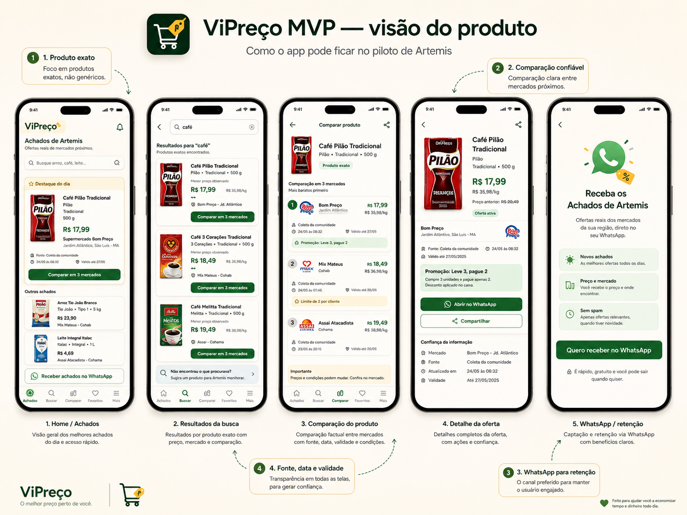

# Contrato de implementação visual — North Star do MVP

**Registrado em 2026-08-05.** **Atualizado em 2026-08-06** com o North Star V2. Normativo para
direção visual. Subordinado ao `PLANO-MESTRE.md` e aos contratos funcionais de `docs/product/` e
`docs/data/`.

> **Duas gerações de North Star, e nenhuma delas é lei funcional.**
>
> - **North Star original** — o PNG abaixo, aprovado em 05/08/2026. **Histórico**, e continua
>   sendo a referência de forma: paleta, densidade, tom, formato de card.
> - **North Star V2** — aprovado em 06/08/2026 como **referência atual de produto e design**. As
>   decisões consolidadas e a matriz elemento a elemento estão em
>   [`NORTH-STAR-V2-ASSESSMENT.md`](./NORTH-STAR-V2-ASSESSMENT.md). **Os binários não foram
>   recebidos** — o registro da ausência está em §2 daquele documento e em
>   [`visual-north-star-v2/README.md`](./visual-north-star-v2/README.md), e nenhum arquivo foi
>   inventado para preencher a lacuna.
>
> A hierarquia da §2 abaixo continua idêntica para as duas: em conflito **funcional**, ganham os
> contratos da `main`.



| Item         | Valor                                                                                            |
| ------------ | ------------------------------------------------------------------------------------------------ |
| Arquivo      | [`visual-north-star/vipreco-mvp-north-star.png`](./visual-north-star/vipreco-mvp-north-star.png) |
| SHA-256      | `7b7a28b5feeac4f23df770e6719e7492a8dc5298e42e23f5e104211b89cbb858`                               |
| Dimensões    | 1448 × 1086 px, PNG RGB de 8 bits, não entrelaçado                                               |
| Tamanho      | 1 741 410 bytes                                                                                  |
| Aprovada por | Founder, em 05/08/2026                                                                           |
| Recompressão | **nenhuma** — o hash do arquivo versionado é idêntico ao do original                             |

---

## 1. O que esta imagem é, e o que ela não é

**É** a direção visual oficial do MVP: paleta, hierarquia, densidade, tom, forma dos cards,
posição dos blocos de confiança, ordem de leitura.

**Não é** fonte de dado, e a distinção não é formalidade — é a diferença entre uma referência
de design e um vazamento de conteúdo inventado para dentro do produto.

Nada do que aparece na imagem pode ser tratado como real:

| Na imagem                                    | Estado real                                                                   |
| -------------------------------------------- | ----------------------------------------------------------------------------- |
| Mercados (Bom Preço, Mix Mateus, Assaí)      | **ilustrativos** — nenhum é parceiro, nenhum autorizou nada                   |
| Bairro e cidade (Jardim Atlântico, São Luís) | **ilustrativos** — o piloto é em **Artemis, Piracicaba-SP**                   |
| Preços, `R$ /kg`, preço anterior             | **ilustrativos** — nenhum foi observado                                       |
| Promoções e limites por cliente              | **ilustrativos**                                                              |
| Datas e validades                            | **ilustrativas**                                                              |
| Imagens e marcas de produto                  | **ilustrativas** — ver [`docs/data/IMAGE-POLICY.md`](../data/IMAGE-POLICY.md) |
| Logotipos de rede                            | **ilustrativos** — nenhum direito de uso foi obtido                           |

Um mockup que vira dado é um risco jurídico e de confiança, não um detalhe estético. Ao
implementar qualquer tela, os dados vêm do fixture demo versionado ou do banco — **nunca** da
leitura da imagem.

---

## 2. Hierarquia de autoridade

```
PLANO-MESTRE.md
   └── contratos funcionais (docs/product/, docs/data/, docs/analytics/)
          └── ESTE CONTRATO  ← direção visual
                 └── R3-SCREEN-SPEC.md  →  R3-COMPONENT-INVENTORY.md
```

- a **`main`** é a fonte normativa **funcional**;
- o North Star define **direção visual**, não comportamento, não dado, não regra;
- em qualquer conflito **funcional**, ganham os contratos da `main` — sem exceção e sem
  discussão caso a caso;
- em conflito **estético** não coberto por contrato, decide o Founder.

### Conflitos já identificados entre a imagem e os contratos

Registrados agora para que ninguém os "resolva" implementando o que viu:

| Onde na imagem                  | Conflito                                                                                      | Quem ganha                                                               |
| ------------------------------- | --------------------------------------------------------------------------------------------- | ------------------------------------------------------------------------ |
| `R$ 35,98/kg` em todos os cards | preço unitário exige quantidade **estruturada e confiável**, que só existe depois de E1       | contrato — o preço unitário é **condicional**, e some quando não há base |
| "Preço anterior: R$ 20,49"      | exige histórico válido do **mesmo** SKU no **mesmo** mercado                                  | contrato — sem histórico, o bloco não é renderizado                      |
| Barra inferior com 5 abas       | as rotas atuais são `/`, `/buscar`, `/produto/$productId`, `/como-funciona`, `/para-mercados` | a navegação real é decidida em R3.3, não copiada da imagem               |
| "Favoritos"                     | não existe no escopo do MVP                                                                   | contrato — [`ROADMAP-MVP-v3.md`](./ROADMAP-MVP-v3.md) §4                 |
| Sino de notificação no header   | notificações estão **fora do MVP**                                                            | contrato — CLAUDE.md, princípio 9                                        |
| Logotipos de rede nos cards     | imagem de terceiro sem direito de uso                                                         | contrato — placeholder ou nome em texto                                  |

Esta tabela é parte do contrato. Um item aqui **não** vira tarefa por conveniência: vira
decisão registrada, ou não entra.

**Os seis conflitos acima viraram decisão em 06/08/2026**, junto de mais catorze itens, na
matriz de [`NORTH-STAR-V2-ASSESSMENT.md`](./NORTH-STAR-V2-ASSESSMENT.md) §3. Dois deles mudaram
de resposta e vale registrar aqui, porque é onde alguém vai procurar:

| Item                       | O que a matriz decidiu                                                                       |
| -------------------------- | -------------------------------------------------------------------------------------------- |
| Barra inferior com 5 abas  | **duas abas B2C** — Achados e Buscar. "Comparar" não é aba: a comparação nasce de um produto |
| "Preço anterior: R$ 20,49" | **removido** do Card v2 até P-01 (MVP-DOCS-02) ser decidida — ver DL-030                     |

---

## 3. Os vinte princípios

### Forma

1. **Fundo creme.** A base não é branca. O creme reduz o contraste bruto e faz o verde e o
   preço saltarem sem precisar de peso tipográfico extra.
2. **Verde-escuro como cor principal.** Marca, CTA primário, ênfase estrutural.
3. **Verde suave para estados positivos.** Fundo de promoção, confirmação, disponibilidade.
   Nunca para urgência.
4. **Amarelo restrito.** Só destaque do dia e avisos de condição. Amarelo abundante vira
   alarme, e alarme falso é o começo da desconfiança.
5. **Cards arredondados.** Raio consistente; o card é a unidade de leitura.
6. **Sombras discretas.** Elevação para separar, não para decorar.
7. **Interface clara e humana.** Português simples, sem jargão, sem grito.

### Conteúdo

8. **Produto exato antes do preço.** O usuário precisa reconhecer **o que é** antes de comparar
   quanto custa. Preço sem identidade é número solto.
9. **Marca, variante e quantidade legíveis.** Não podem ser texto secundário apagado: são o que
   distingue 250 g de 500 g e tradicional de descafeinado.
10. **Preço, mercado, fonte, data e validade são um bloco inseparável.** Nenhum dos cinco pode
    aparecer sozinho. Preço sem procedência é boato.
11. **Imagem errada é pior que ausência de imagem.** Sem correspondência exata de variante e
    gramatura, usa-se placeholder. Ver [`IMAGE-POLICY.md`](../data/IMAGE-POLICY.md).
12. **Preço unitário só com quantidade confiável.** Sem quantidade estruturada, o campo não
    aparece — não aparece "—", não aparece estimativa.
13. **Promoção sempre com condição explícita.** "Leve 3, pague 2" sem o "desconto no caixa" e
    sem o limite por cliente é meia informação, que é pior que nenhuma.

### Neutralidade

14. **Ranking neutro.** A ordem é preço crescente → observação mais recente → `id`. O terceiro
    critério não é opcional.
15. **Conteúdo pago nunca influencia ordem.** Vive em seção separada e rotulada. Vale também
    para promoção estruturada: a ordem é pelo preço de prateleira.
16. **WhatsApp é retenção, não é o produto.** A comparação é o núcleo.
17. **Nenhum mercado fictício apresentado como parceiro.** Nem no mockup implementado, nem em
    material de venda.
18. **Nenhuma promessa absoluta de menor preço.** O texto correto é "menor preço **observado**",
    com data. O ViPreço afirma o que mediu, não o que existe no mundo.

### Não negociável

19. **Acessibilidade não é sacrificável por estética.** Alvo ≥ 44 px, foco visível, contraste
    AA, labels associados, `role="alert"` em erro, `aria-live` em carregamento. Se a estética e
    a acessibilidade colidirem, muda a estética.
20. **Mobile first.** Funcional a partir de 360 px. O desktop é consequência, não origem.

---

## 4. Como uma tela pode ser implementada

**Nenhuma tela pode ser criada "parecida" por interpretação livre da imagem.** Olhar o mockup e
reproduzir o que se vê produz exatamente os seis conflitos da §2 — e produz em silêncio, porque
o resultado parece certo.

O caminho obrigatório, por tela:

1. ler a especificação em [`R3-SCREEN-SPEC.md`](./R3-SCREEN-SPEC.md);
2. ler os componentes em [`R3-COMPONENT-INVENTORY.md`](./R3-COMPONENT-INVENTORY.md);
3. implementar contra os **contratos**, usando a imagem como referência de forma;
4. cobrir com teste todo estado listado na spec — inclusive vazio, erro e desatualizado;
5. rodar `bun run lint && bun run test && bun run build`;
6. produzir **screenshot** em 360 px e em desktop;
7. abrir PR com os screenshots;
8. **Gate do Founder** — sem aprovação explícita, a tela não avança nem é usada como base para
   a próxima.

O screenshot não é enfeite de PR: é a única forma de o Founder revisar fidelidade visual sem
rodar o projeto. Sem ele, a revisão vira confiança cega.

---

## 5. O que este contrato não autoriza

Este documento **não** inicia R3. Ele descreve como R3 será feita quando for autorizada.

Nesta missão não foi criado nenhum componente, nenhum CSS, nenhuma rota, nenhuma alteração de
Home, nenhuma dependência.

---

## Documentos relacionados

- [`NORTH-STAR-V2-ASSESSMENT.md`](./NORTH-STAR-V2-ASSESSMENT.md) — a matriz do North Star V2
- [`ROADMAP-MVP-V2.md`](./ROADMAP-MVP-V2.md) — as duas trilhas, B2C e B2B
- [`R3-SCREEN-SPEC.md`](./R3-SCREEN-SPEC.md) — as cinco telas, campo a campo
- [`R3-COMPONENT-INVENTORY.md`](./R3-COMPONENT-INVENTORY.md) — os componentes e o roadmap R3→R7
- [`CANONICAL-PRODUCT-SPEC.md`](./CANONICAL-PRODUCT-SPEC.md) — identidade exata de produto
- [`CARD-V2-SPEC.md`](./CARD-V2-SPEC.md) — o card que precede a Home
- [`COMPARISON-SPEC.md`](./COMPARISON-SPEC.md) — regras da comparação
- [`PRODUCT-PRINCIPLES.md`](./PRODUCT-PRINCIPLES.md) — princípios de produto
- [`ROADMAP-MVP-v3.md`](./ROADMAP-MVP-v3.md) — escopo e "Fora do MVP"
- [`../data/IMAGE-POLICY.md`](../data/IMAGE-POLICY.md) — quando existe imagem
- [`../pmo/MVP-DECISION-LOG.md`](../pmo/MVP-DECISION-LOG.md) — DL-024
